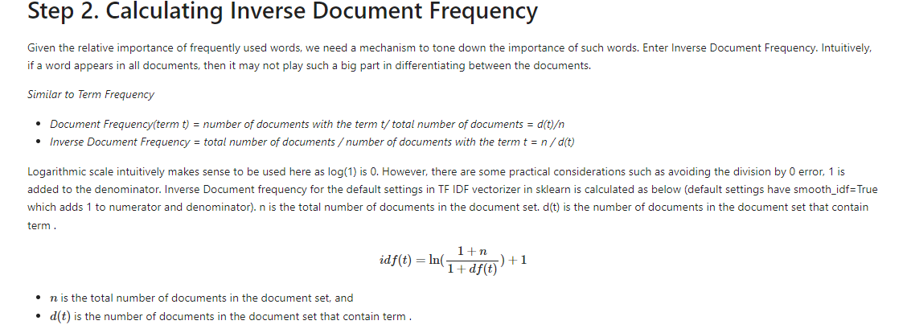

# Guide on how to use TDF to generate weightage
1. Run the curate_mitre_reports.py to scrape the MITRE reports
2. All reports should be stored in the mitre_nav_reports directory
3. Run the idf.py as a python module. generate_idf_weights method will return a dictonary of mitre ttps with its respective weights.
## Why use IDF?

## Notes
- Only reports from the mitre websites are used to generate weightage. TTPs from CTI reports are not accounted in yet.
